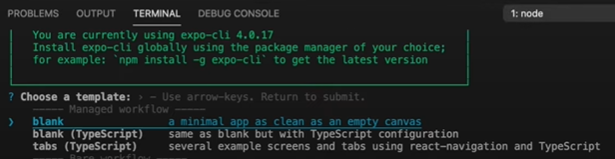
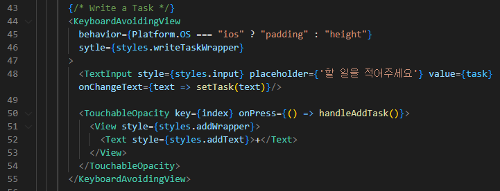
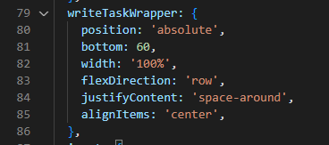

# Clone Todo List App by React Native

[👉 Build your first React Native app - Todo List Tutorial Part 1 - YouTube](https://www.youtube.com/watch?v=0kL6nhutjQ8)

[👉 Build your first React Native app - Todo List Tutorial Part 2 - YouTube](https://www.youtube.com/watch?v=00HFzh3w1B8)

[Source code](./original)

<br/>

## Summary

* Learn React Native basic by cloning an app before a mobile app project

* July 19, 2022 - July 20, 2022

<br/>

## Key Learnings

* Set up dependencies

* Create beautiful frontends

* Pass props

* Manage State

<br/>

## Basic Environment Setting

```bash
npm install --global expo-cli
expo init todoList
```



* choose `blank`

```bash
cd todoList
expo start
```

* `i` : Open on iOS / `a` : Open on Android
  
  * Download React Native app or install Android Studio and use its emulator
    
    * [Connect React Native to Android Emulator (KR)](https://leirbag.tistory.com/113)

* For communication API
  
  * localhost doesn't work => `10.0.0.2`
    
    [Emulator Networking setting](https://developer.android.com/studio/run/emulator-networking?hl=ko)

<br/>

## What I Learn

* Not `<div>` but `<View>`

* Every tag starts with a capital letter

* Must follow camelCase

* Attribute form : `attributeName={aaa.ccc}`

* 

## Question

* Why styles doesn't work.    
  
  
  
  
  
  In `<KeyboardAvoidingView>`, there're `<TextInput>` and `<Touchableopacity>` which are under `Styles.writeTaskWrapper` but they're not on the same line as in the tutorial!

* `index` variable Error
